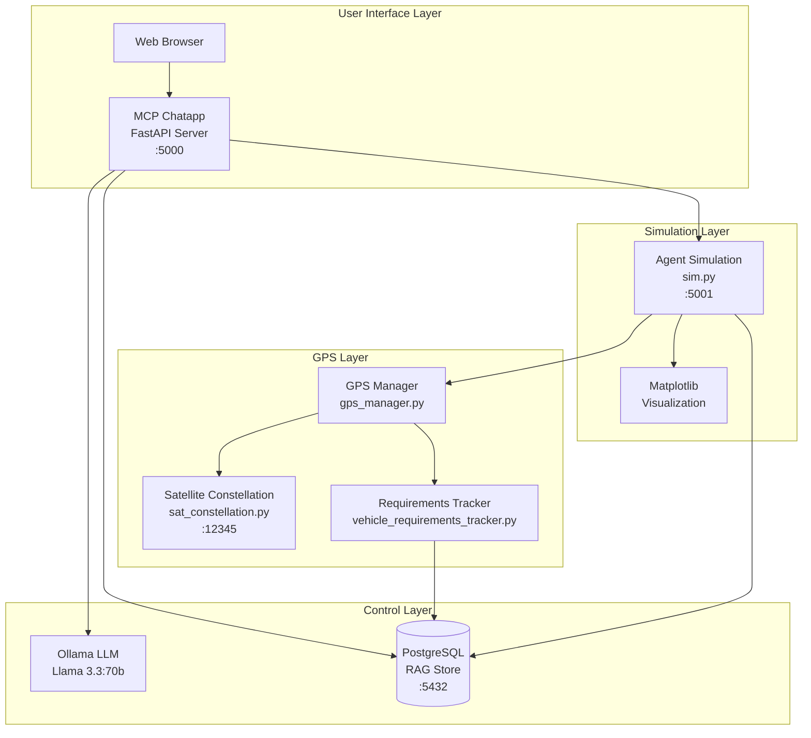
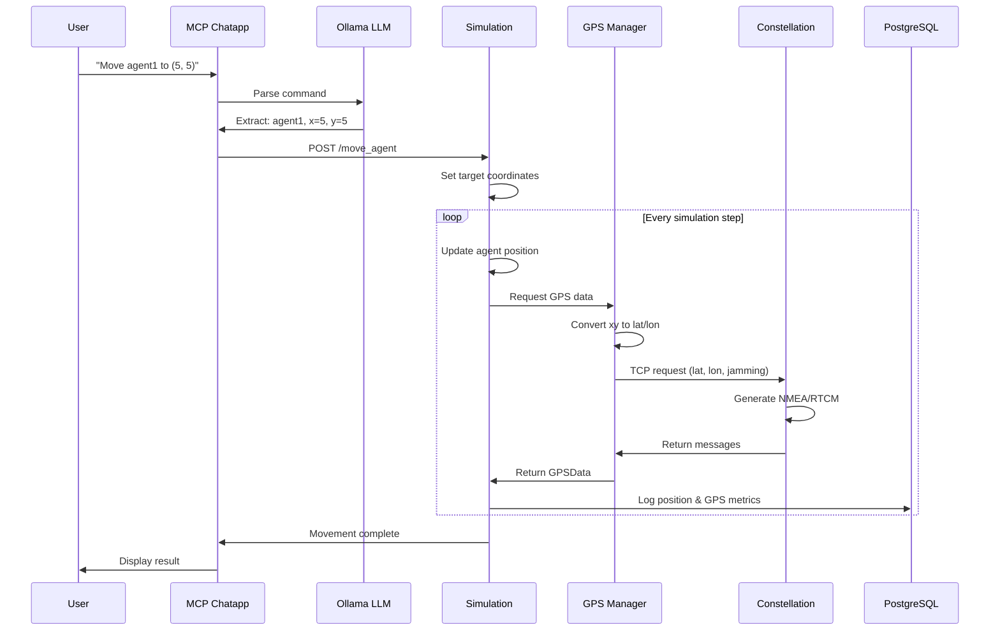
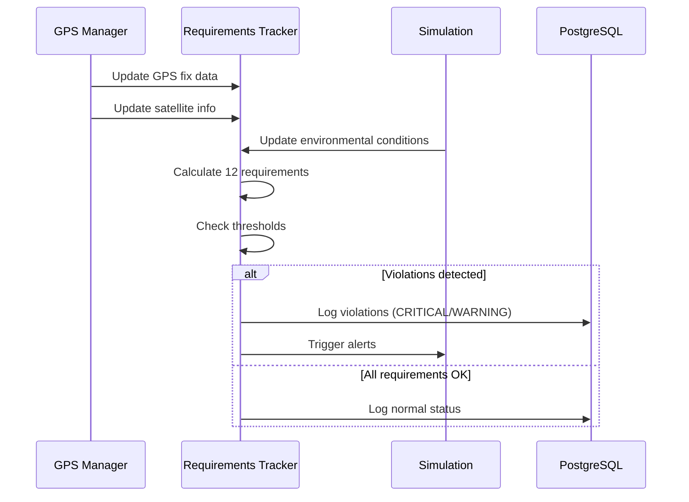
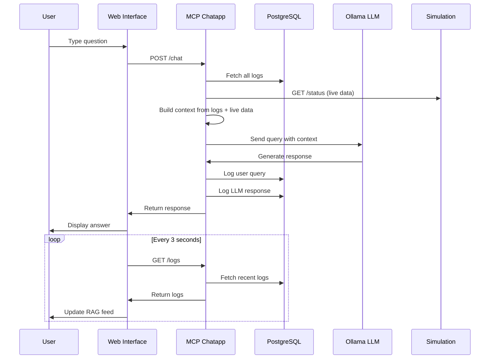

# Multi-Agent GPS Simulation with Jamming Detection

A comprehensive simulation system for testing GPS denial detection in multi-agent scenarios with LLM-based control and RAG (Retrieval-Augmented Generation) capabilities.

## Table of Contents

- [Overview](#overview)
- [System Architecture](#system-architecture)
- [File Structure](#file-structure)
- [Data Flow](#data-flow)
- [Prerequisites](#prerequisites)
- [Installation](#installation)
- [Quick Start](#quick-start)
- [Detailed Usage](#detailed-usage)
- [Configuration](#configuration)
- [API Reference](#api-reference)
- [Development](#development)
- [Troubleshooting](#troubleshooting)

## Overview

This system simulates multiple autonomous agents navigating through an environment with GPS jamming zones. It includes:

- **Satellite Constellation Server**: Generates realistic NMEA/RTCM GPS messages
- **Multi-Agent Simulation**: Agents with autonomous movement and jamming detection
- **Requirements Tracking**: Monitors 12 GPS denial detection indicators per agent
- **LLM Integration**: Natural language control via Ollama (Llama 3.3)
- **RAG System**: PostgreSQL-based logging and context retrieval
- **Web Interface**: Real-time monitoring and chat-based control

## System Architecture



## File Structure

```
.
├── README.md                           # This file
├── todo.md                            # Development notes
│
├── Core Configuration
├── constellation_config.json          # Satellite constellation parameters
├── requirements_config.json           # GPS denial detection thresholds
├── llm_config.py                      # Shared LLM configuration
├── docker-compose.yml                 # PostgreSQL database setup
│
├── GPS/GNSS System
├── sat_constellation.py               # NMEA/RTCM message generator (Server)
├── gps_client_lib.py                  # GPS client data structures
├── gps_manager.py                     # Agent GPS data coordinator
├── vehicle_requirements_tracker.py    # 12 GPS denial indicators tracker
├── sim_reqs_tracker.py               # Integration with simulation
│
├── Simulation Engine
├── sim.py                            # Main agent simulation
├── sim_helper_funcs.py               # Movement and utility functions
│
├── Web Interface & Control
├── mcp_chatapp.py                    # FastAPI server + MCP tools
├── templates/
│   └── index.html                    # Web UI template
├── static/
│   ├── css/
│   │   └── style.css                 # UI styling
│   └── js/
│       └── script.js                 # Frontend logic
│
└── Orchestration
    └── startup.py                     # System startup manager
```

### Component Descriptions

#### GPS/GNSS System
- **sat_constellation.py**: TCP server generating realistic NMEA sentences (GGA, RMC, GSA, GSV) and RTCM corrections based on agent position and environmental conditions
- **gps_client_lib.py**: Data classes (GPSFix, SatelliteInfo, GPSData) and client for communicating with constellation server
- **gps_manager.py**: Manages GPS requests for all agents, converts sim coordinates to lat/lon
- **vehicle_requirements_tracker.py**: Tracks 12 key requirements for detecting GPS denial (signal quality, satellite count, position consistency, etc.)
- **sim_reqs_tracker.py**: Integration layer connecting requirements tracker with simulation state

#### Simulation Engine
- **sim.py**: Main simulation with agent movement, jamming zones, matplotlib visualization, and FastAPI endpoints
- **sim_helper_funcs.py**: Utility functions for coordinate conversion, path planning, LLM prompting, and data logging

#### Web Interface & Control
- **mcp_chatapp.py**: FastAPI server providing chat interface, agent control API, and MCP tool integration
- **templates/index.html**: Split-screen UI with RAG feed and chat interface
- **static/**: CSS and JavaScript for real-time log updates and command processing

#### Configuration
- **constellation_config.json**: Satellite counts, signal quality parameters, error injection rates
- **requirements_config.json**: 12 GPS denial detection requirements with thresholds and warning levels
- **llm_config.py**: Centralized Ollama model configuration
- **docker-compose.yml**: PostgreSQL with pgvector extension for RAG storage

## Data Flow

### Agent Movement Flow



### Requirements Monitoring Flow



### Chat & RAG Flow



## Prerequisites


### Required Software

1. **Docker & Docker Compose**
```bash
sudo apt install -y docker.io docker-compose; sudo groupadd docker; sudo usermod -aG docker $USER; sudo systemctl start docker; sudo systemctl enable docker; newgrp docker; DOCKER_CONFIG=${DOCKER_CONFIG:-$HOME/.docker}; mkdir -p $DOCKER_CONFIG/cli-plugins; curl -SL https://github.com/docker/compose/releases/download/v2.35.0/docker-compose-linux-x86_64 -o $DOCKER_CONFIG/cli-plugins/docker-compose; chmod +x $DOCKER_CONFIG/cli-plugins/docker-compose; docker compose version
```

```bash
sudo apt update
sudo apt install python3-tk
```

2. **Ollama**
```bash
curl -fsSL https://ollama.com/install.sh | sh
```

3. **Python Dependencies**
```bash
pip install -r requirements.txt
```

## Installation

### 1. Clone the Repository
```bash
git clone <your-repo-url>
cd <repo-directory>
```

### 2. Install Python Dependencies
```bash
pip install -r requirements.txt

# Or manually:
pip install fastapi uvicorn psycopg2-binary ollama matplotlib numpy pynmea2 pyrtcm httpx
```

### 3. Pull Ollama Model
```bash
ollama pull llama3.3:70b-instruct-q5_K_M
```

### 4. Start Docker Services
```bash
# Start PostgreSQL
docker compose up -d

# Verify it's running
docker compose ps

# Check logs if needed
docker compose logs -f
```

### 5. Initialize Database
```bash
# The database will be automatically initialized on first run
# Schema location: rag_store.py (imported by mcp_chatapp.py)
```

## Quick Start

### Option 1: Using Startup Script (Recommended)

```bash
# Start all services
python startup.py

# Output will show:
# - Satellite Constellation Server on tcp://0.0.0.0:12345
# - Agent Simulation on http://0.0.0.0:5001
# - MCP Chatapp on http://0.0.0.0:5000

# Access the web interface
# Open browser to: http://0.0.0.0:5000

# Stop all services
# Press Ctrl+C in the terminal running startup.py
```

### Option 2: Manual Start (For Development)

```bash
# Terminal 1: Start Ollama service
ollama serve

# Terminal 2: Start PostgreSQL
docker compose up

# Terminal 3: Start Satellite Constellation
python sat_constellation.py

# Terminal 4: Start Agent Simulation
python sim.py

# Terminal 5: Start MCP Chatapp
python mcp_chatapp.py

# Access web interface at http://0.0.0.0:5000
```

## Detailed Usage

### Starting the System

#### 1. Ensure Prerequisites are Running

```bash
# Check Ollama is running
ollama list

# Check Docker is running
docker ps

# Start database if not running
docker compose up -d
```

#### 2. Start All Components

```bash
python startup.py
```

Expected output:
```
╔═══════════════════════════════════════════════════════╗
║                                                       ║
║         GPS SIMULATION WITH JAMMING DETECTION         ║
║                                                       ║
║  Components:                                          ║
║    • Satellite Constellation (NMEA/RTCM Generator)    ║
║    • Multi-Agent Simulation (Movement & Jamming)      ║
║    • Requirements Monitor (GPS Denial Detection)      ║
║    • MCP Chatapp (LLM Control & RAG)                  ║
║                                                       ║
╚═══════════════════════════════════════════════════════╝

[STARTUP] Checking dependencies...
[STARTUP] All dependencies found
[STARTUP] Checking database...
[STARTUP] Database connection OK
[STARTUP] Starting Satellite Constellation...
[STARTUP] Satellite Constellation started (PID: 12345)
[STARTUP] Starting Agent Simulation...
[STARTUP] Agent Simulation started (PID: 12346)
[STARTUP] Starting MCP Chatapp...
[STARTUP] MCP Chatapp started (PID: 12347)

[STARTUP] All components started successfully!

Access points:
  • MCP Chatapp:          http://0.0.0.0:5000
  • Simulation API:       http://0.0.0.0:5001
  • Constellation Server: tcp://0.0.0.0:12345

Press Ctrl+C to stop all services
```

### Using the Web Interface

1. **Open Browser**: Navigate to `http://0.0.0.0:5000`

2. **RAG Feed (Left Panel)**:
   - Shows real-time log entries from all agents
   - Color-coded by status (green=clear, red=jammed)
   - Updates automatically every 3 seconds
   - Displays position, communication quality, GPS metrics

3. **Chat Interface (Right Panel)**:
   - Type natural language commands or questions
   - Examples:
     - "Move agent1 to coordinates (5, 5)"
     - "What is agent2's current status?"
     - "Are any agents jammed?"
     - "Show me GPS metrics for agent3"

### Example Commands

```bash
# Movement commands (via chat)
"Move agent1 to (10, 5)"
"Send agent2 to coordinates (-3, 7)"
"Move agent3 to position (0, 0)"

# Status queries (via chat)
"What is agent1's position?"
"Are any agents jammed?"
"Show me communication quality for all agents"
"What's the GPS fix quality for agent2?"

# Direct API calls (for automation)
curl -X POST http://0.0.0.0:5001/move_agent \
  -H "Content-Type: application/json" \
  -d '{"agent": "agent1", "x": 5.0, "y": 5.0}'

curl http://localhost:5001/status

curl http://localhost:5001/gps_status
```

### Stopping the System

#### Graceful Shutdown
```bash
# If using startup.py
Press Ctrl+C in the terminal

# Manual shutdown
pkill -f sat_constellation.py
pkill -f sim.py
pkill -f mcp_chatapp.py
```

#### Stop Docker Services
```bash
# Stop but keep data
docker compose stop

# Stop and remove containers (keeps data)
docker compose down

# Stop and remove everything including data
docker compose down -v
sudo rm -rf ./pgdata
```

## Configuration

### Simulation Parameters (sim.py)

```python
# Movement and environment
update_freq = 2.5           # Simulation update frequency (seconds)
max_movement_per_step = 1.41  # Maximum distance per step
mission_end = (10, 10)      # Target endpoint
jamming_center = (0, 0)     # Center of jamming zone
jamming_radius = 5          # Radius of jamming zone

# Control mode
USE_LLM = False  # Set to True for LLM control, False for algorithm

# Agent configuration
num_agents = 5
```

### Constellation Parameters (constellation_config.json)

```json
{
  "gps_satellites": 32,
  "signal_quality": {
    "base_cnr": 45.0,
    "noise_floor": 20.0,
    "jamming_threshold": 70.0
  },
  "error_injection": {
    "cycle_slip_probability": 0.01,
    "checksum_error_probability": 0.001
  }
}
```

### Requirements Thresholds (requirements_config.json)

```json
{
  "Signal Quality Indicators": {
    "Fix Quality and Satellite Monitoring": {
      "Satellite Count Critical Threshold": {
        "threshold": 4,
        "warning_threshold": 6,
        "unit": "satellites"
      }
    }
  }
}
```

### LLM Configuration (llm_config.py)

```python
LLM_MODEL = "llama3.3:70b-instruct-q5_K_M"
```

## API Reference

### Simulation API (Port 5001)

#### GET /status
Returns current simulation state
```json
{
  "running": true,
  "iteration_count": 142,
  "agent_positions": {
    "agent1": {
      "x": 5.2,
      "y": 3.8,
      "communication_quality": 0.8,
      "jammed": false
    }
  }
}
```

#### POST /move_agent
Move an agent to specific coordinates
```json
{
  "agent": "agent1",
  "x": 10.0,
  "y": 5.0
}
```

#### GET /gps_status
Get GPS data for all agents
```json
{
  "gps_enabled": true,
  "gps_status": {
    "agent1": {
      "fix_quality": 6,
      "satellites": 10,
      "signal_quality": 45.2
    }
  }
}
```

### MCP Chatapp API (Port 5000)

#### POST /chat
Send a chat message
```json
{
  "message": "What is agent1's status?"
}
```

#### POST /llm_command
Execute a natural language command
```json
{
  "message": "Move agent1 to (5, 5)"
}
```

#### GET /logs
Retrieve recent logs
```json
{
  "logs": [
    {
      "log_id": "123",
      "text": "Agent agent1 is at position (5, 5)...",
      "metadata": {
        "agent_id": "agent1",
        "jammed": false
      }
    }
  ]
}
```

## Development

### Running Tests

```bash
# Test satellite constellation
python sat_constellation.py
# Should start server on port 12345

# Test GPS client
python gps_client_lib.py

# Test requirements tracker
python vehicle_requirements_tracker.py
```

### Debug Mode

Enable verbose logging:
```python
# In sim.py, llm_config.py, or mcp_chatapp.py
import logging
logging.basicConfig(level=logging.DEBUG)
```

### Database Access

```bash
# Connect to PostgreSQL
docker exec -it rag_db psql -U postgres -d rag_db

# View logs table
SELECT * FROM logs ORDER BY created_at DESC LIMIT 10;

# Count logs by agent
SELECT metadata->>'agent_id' as agent, COUNT(*) 
FROM logs 
GROUP BY metadata->>'agent_id';
```

## Troubleshooting

### Ollama Connection Issues

```bash
# Check if Ollama is running
curl http://localhost:11434/api/version

# If not running, start it
ollama serve

# Test model availability
ollama list
ollama run llama3.3:70b-instruct-q5_K_M "test"
```

### Database Connection Errors

```bash
# Check if container is running
docker compose ps

# View logs
docker compose logs -f carsdb

# Restart database
docker compose restart carsdb

# Reset database completely
docker compose down -v
sudo rm -rf ./pgdata
docker compose up -d
```

### Port Already in Use

```bash
# Find process using port 5000
lsof -i :5000
sudo netstat -tlnp | grep 5000

# Kill process
kill -9 <PID>

# Or use different ports in code
```

### Simulation Not Updating

1. Check if matplotlib window is responsive
2. Verify agents are initialized: Check console output
3. Ensure animation is not paused: Click "Continue" button
4. Check for Python errors in terminal

### GPS Data Not Appearing

```bash
# Verify constellation server is running
netstat -an | grep 12345

# Test GPS client connection
python -c "
from gps_client_lib import GPSClient
client = GPSClient()
print('Connected:', client.connect())
"

# Check sat_constellation.py logs
```

### Web Interface Not Loading

```bash
# Check MCP server
curl http://localhost:5000/test

# Check static files exist
ls static/css/style.css
ls static/js/script.js
ls templates/index.html

# View FastAPI logs
# (should be visible in startup.py output)
```