# LLM-Based Distributed Multi-Agent Systems: A Comprehensive Review with Focus on Communication Challenges and Denial Mechanisms

The landscape of large language model (LLM) based multi-agent systems has rapidly evolved into a sophisticated field that leverages the collaborative intelligence of multiple specialized agents to tackle complex computational challenges beyond the scope of single-agent approaches. Recent research has demonstrated that these systems achieve remarkable improvements in reasoning, planning, and problem-solving capabilities through strategic agent collaboration and communication protocols. However, while existing survey literature has comprehensively covered architectural designs and general communication strategies, a critical gap remains in understanding communication denial mechanisms, network robustness, and the implications of communication failures in distributed LLM-based multi-agent environments. This review synthesizes current research contributions across the field while establishing a focused research agenda for communication denial challenges, sparse communication topologies, and fault-tolerant distributed agent coordination. The analysis reveals that current systems predominantly assume reliable communication channels, leaving significant vulnerabilities in adversarial or resource-constrained environments where communication denial becomes a critical factor affecting system performance and reliability.

```mermaid
%% Current Landscape of LLM-Based Distributed Multi-Agent Systems
flowchart TD
    A[Current Landscape] --> B[Core Components]
    A --> C[Communication Mechanisms]
    A --> D[Architectural Innovations]
    A --> E[Applications]
    A --> F[Evaluation Methods]

    B --> B1[Agent Profiling]
    B --> B2[Perception Modules]
    B --> B3[Self-Action Policies]
    B --> B4[Interaction Protocols]
    B --> B5[Evolution Strategies]

    C --> C1[Sparse Communication Topologies]
    C --> C2[Multi-Agent Debate Frameworks]
    C --> C3[Content-Optimized Protocols]
    C --> C4[Knowledge Dissemination Patterns]

    D --> D1[Distributed Processing]
    D --> D2[Specialized Agent Roles]
    D --> D3[Load Balancing]
    D --> D4[Multimodal Integration]

    E --> E1["Problem-Solving
    (Traffic Control, Power Grids)"]
    E --> E2["World Simulation
    (Social Dynamics, Economic Systems)"]
    E --> E3[Scientific Review Automation]

    F --> F1[Introspective Leave-One-Out]
    F --> F2[Contribution Attribution]
    F --> F3[Computational Efficiency Metrics]
```

```mermaid
%% Future Directions of LLM-Based Distributed Multi-Agent Systems
flowchart TD
    G[Future Directions] --> H[Communication Denial Resistance]
    G --> I[Adaptive Communication Strategies]
    G --> J[Adversarial-Aware Systems]
    G --> K[Enhanced Evaluation]
    G --> L[Expanded Applications]

    H --> H1[Redundant Communication Protocols]
    H --> H2[Dynamic Rerouting Mechanisms]
    H --> H3[Critical Path Identification]
    H --> H4[Graceful Degradation]

    I --> I1[Real-Time Topology Optimization]
    I --> I2[Content Compression Techniques]
    I --> I3[Bandwidth-Aware Scheduling]
    I --> I4[Context-Adaptive Protocols]

    J --> J1[Attack Detection]
    J --> J2[Game-Theoretic Defense]
    J --> J3[Cybersecurity Integration]
    J --> J4[Decoy Communication Patterns]

    K --> K1[Systematic Failure Testing]
    K --> K2[Adversarial Benchmarking]
    K --> K3[Resilience Metrics]
    K --> K4[Cross-Domain Evaluation]

    L --> L1[Healthcare Coordination]
    L --> L2[Autonomous Defense Systems]
    L --> L3[Environmental Monitoring]
    L --> L4[Disaster Response]
```

## Current Landscape and Existing Survey Literature

The field of LLM-based multi-agent systems has experienced unprecedented growth, resulting in multiple comprehensive survey efforts that map the evolving research landscape. The foundational survey by Li et al. presents an extensive analysis of progress and challenges in LLM-based multi-agent systems, covering essential aspects including agent profiling, communication mechanisms, and capacity growth strategies[^2]. This work establishes a framework for understanding how LLM-based agents simulate various domains and environments, providing crucial insights into the fundamental building blocks of multi-agent collaboration.

Building upon this foundational work, subsequent surveys have adopted specialized perspectives to address specific aspects of the field. The communication-centric survey by researchers examining system-level features demonstrates how communication elements interplay to enable collective intelligence and flexible collaboration[^4]. This perspective highlights the critical role of communication architecture design, goals, strategies, paradigms, objects, and content in determining system effectiveness. The survey identifies key challenges including scalability, security, and multimodal integration, establishing communication as a central pillar for future research directions.

A parallel survey effort focuses specifically on LLM's role in multi-agent collaboration, emphasizing the transition from single-agent systems to coordinated multi-agent approaches for handling complex tasks requiring coordination[^3]. This work addresses practical applications in domains such as power grid management and traffic control systems, where single-agent limitations necessitate collaborative approaches. The survey provides valuable insights into current research challenges and key issues while exploring potential development directions.

The software engineering domain has received particular attention through a systematic review that maps LMA applications across various stages of the software development lifecycle[^8]. This specialized survey demonstrates the transformative potential of integrating LLMs into multi-agent systems for addressing complex software engineering challenges, highlighting how collaborative and specialized agent abilities enable autonomous problem-solving and scalable solutions for real-world software projects.

### Research Contributions and Innovation Patterns

The existing survey literature reveals several distinct innovation patterns in LLM-based multi-agent systems. The Multi-Agent Review Generation (MARG) system represents a significant breakthrough in feedback generation for scientific papers, utilizing multiple LLM instances that engage in internal discussion[^1]. By distributing paper text across agents and specializing agents for different comment types including experiments, clarity, and impact assessment, MARG substantially improves the ability of GPT-4 to generate specific and helpful feedback, reducing generic comments from 60% to 29% and generating 3.7 good comments per paper compared to 1.7 in baseline methods.

Communication efficiency has emerged as a critical research frontier, with investigations into sparse communication topology demonstrating that multi-agent debates leveraging reduced connectivity can achieve comparable or superior performance while significantly reducing computational costs[^5]. These findings challenge the traditional assumption that full connectivity among agents is necessary for optimal performance, revealing that strategic communication patterns can enhance both effectiveness and efficiency in multi-agent frameworks.

## Communication Denial and Network Robustness Challenges

### Sparse Communication Topologies and Performance Trade-offs

Recent research has begun to address the fundamental question of communication efficiency in multi-agent systems, revealing that sparse communication topologies can significantly enhance both effectiveness and efficiency compared to fully-connected configurations[^5]. The investigation of multi-agent debate frameworks demonstrates that strategic communication restrictions, rather than hindering performance, can actually improve system outcomes while dramatically reducing computational costs by 50-53% in various tasks.

The concept of communication denial, whether intentional or circumstantial, represents a critical challenge that current LLM-based multi-agent systems are not adequately prepared to handle. Traditional approaches assume reliable communication channels between all agents, creating vulnerabilities when communication links are severed, compromised, or deliberately denied. The sparse communication research provides initial insights into how systems can maintain functionality with reduced connectivity, but comprehensive frameworks for handling communication denial scenarios remain underdeveloped.

Experimental evidence reveals that when stronger agents are positioned at higher centrality nodes in non-regular graph configurations, the system can effectively disseminate knowledge to weaker agents, even with limited communication rounds[^5]. This finding suggests that strategic positioning of capable agents can mitigate some effects of communication constraints, but the implications for deliberate communication denial attacks or systematic network failures require further investigation.

### Agent Contribution Assessment Under Communication Constraints

The challenge of assessing individual agent contributions becomes particularly complex under communication denial scenarios. The Introspective Leave-One-Out (IntrospecLOO) method presents an innovative approach for evaluating agent contributions in multi-agent debates while reducing computational complexity[^6]. This method introduces an additional querying round where agents update their answers while ignoring responses from designated agents, effectively isolating participant influence with reduced query complexity compared to traditional leave-one-out approaches.

However, the IntrospecLOO approach assumes that agents can reliably communicate their introspective assessments, which may not hold under communication denial conditions. The method's effectiveness in scenarios where communication channels are compromised or deliberately targeted remains unexplored, representing a significant gap in current evaluation methodologies for robust multi-agent systems.

The implications of communication denial extend beyond simple connectivity issues to encompass strategic vulnerabilities where adversarial actors might target specific communication links to maximize system degradation. Current research has not adequately addressed how to identify critical communication paths, implement redundant communication mechanisms, or develop adaptive protocols that can maintain system functionality under various denial scenarios.

## Architectural Innovations and System Design Patterns

### Distributed Processing and Load Management

The architectural innovations in LLM-based multi-agent systems reveal sophisticated approaches to handling complex tasks through distributed processing mechanisms. The MARG system exemplifies how paper text can be distributed across agents to overcome input length limitations of base LLMs, while simultaneously specializing agents for different analytical tasks[^1]. This distributed approach not only addresses technical constraints but also enables more focused and expert-level analysis from each participating agent.

The specialization patterns observed in current systems suggest a trend toward highly differentiated agent roles, where each agent develops expertise in specific domains or task types. This specialization approach enhances overall system capability but also introduces dependencies that could be exploited in communication denial scenarios. When specialized agents cannot communicate their findings or receive necessary inputs from other agents, the entire system's effectiveness may be compromised.

Current architectural designs predominantly focus on optimizing performance under ideal communication conditions, with limited consideration for graceful degradation under communication constraints. The absence of robust fallback mechanisms and adaptive communication protocols represents a significant vulnerability that could be exploited by adversarial actors or encountered in resource-constrained environments.

### Multimodal Integration and Communication Complexity

The extension of multi-agent debate frameworks to multimodal reasoning introduces additional layers of communication complexity that amplify the challenges associated with communication denial[^5]. Multimodal systems require agents to exchange not only textual information but also visual, auditory, or other sensory data, increasing bandwidth requirements and creating additional points of failure in communication networks.

The integration of different modalities also necessitates more sophisticated communication protocols that can handle heterogeneous data types while maintaining synchronization across agent interactions. These requirements make multimodal multi-agent systems particularly vulnerable to communication denial attacks that target specific data types or communication channels, potentially rendering entire modalities unavailable to the agent collective.

## Critical Research Gaps and Future Directions

### Communication Denial Resistance Mechanisms

The most significant research gap identified in current LLM-based multi-agent systems literature concerns the development of communication denial resistance mechanisms. Future research must address how systems can maintain functionality when communication channels are deliberately targeted, accidentally severed, or systematically compromised. This research direction requires developing adaptive communication protocols that can dynamically reroute information flow, implement redundant communication paths, and maintain essential system functions even when significant portions of the communication network are unavailable.

Research into communication denial resistance should encompass both technical solutions and strategic frameworks for understanding which communication links are most critical for system functionality. Developing methodologies for identifying and protecting critical communication paths, implementing graceful degradation protocols, and enabling rapid recovery from communication disruptions represents an urgent research priority for the field.

The development of adversarial-aware multi-agent systems that can detect and respond to deliberate communication denial attacks requires interdisciplinary collaboration between multi-agent systems researchers, cybersecurity experts, and game theoretic analysts. Understanding how adversarial actors might strategically target communication networks to maximize system disruption could inform the development of more resilient architectural designs.

### Adaptive Communication Strategies

Future research must also address the development of adaptive communication strategies that can optimize information flow based on available communication resources and current system demands. Unlike current approaches that primarily focus on static communication topologies, adaptive strategies would enable real-time adjustment of communication patterns based on network conditions, task requirements, and agent capabilities.

The investigation of dynamic communication topology optimization represents a promising research direction that could enhance both efficiency and robustness in multi-agent systems. Developing algorithms that can automatically identify optimal communication patterns for specific tasks while maintaining system resilience under various failure scenarios could significantly advance the field's practical applicability.

Research into communication content optimization and compression techniques specifically designed for LLM-based agents could also contribute to enhanced system robustness. Developing methods for efficiently summarizing and transmitting essential information between agents could reduce bandwidth requirements and enable continued operation even when communication capacity is severely limited.

### Evaluation Methodologies for Robust Systems

The development of comprehensive evaluation methodologies for assessing multi-agent system robustness under communication denial scenarios represents another critical research direction. Current evaluation approaches primarily focus on performance optimization under ideal conditions, with limited consideration for system behavior under adversarial or constrained communication environments.

Future evaluation frameworks must incorporate systematic testing of communication denial scenarios, including random link failures, targeted attacks on critical communication paths, and gradual network degradation. Developing standardized benchmarks and metrics for assessing system resilience could enable more rigorous comparison of different architectural approaches and communication strategies.

## Mind Map of Current Landscape and Future Directions

The current landscape of LLM-based multi-agent systems can be conceptualized through several interconnected research domains and future trajectory branches. At the core, existing survey literature establishes foundational knowledge across architectural design, communication strategies, and application domains, with specialized surveys covering software engineering applications, communication-centric perspectives, and general progress assessments.

**Current Research Clusters** branch into multiple specialized areas including feedback generation systems like MARG, sparse communication topology investigations, agent contribution assessment methodologies, and multimodal integration approaches. These clusters demonstrate mature research in performance optimization, specialized agent roles, and collaborative intelligence mechanisms.

**Communication Research** forms a critical branch encompassing sparse topology benefits, computational cost reduction, and initial robustness investigations. However, this branch reveals significant gaps in communication denial resistance, adversarial awareness, and adaptive communication protocols.

**Future Research Trajectories** extend into several unexplored domains including communication denial resistance mechanisms, adaptive communication strategies, adversarial-aware system design, and robust evaluation methodologies. These trajectories represent the most promising directions for advancing the field toward practical deployment in challenging environments.

**Application Integration** branches connect theoretical advances to practical domains including software engineering, scientific review processes, traffic management, power grid control, and social simulation. Future directions in this branch emphasize real-world deployment challenges and domain-specific adaptation requirements.

**Evaluation and Assessment** represents an emerging branch that connects current contribution assessment methods with future needs for comprehensive robustness evaluation, standardized benchmarking, and systematic resilience testing under various communication denial scenarios.

## Conclusion

The comprehensive analysis of LLM-based multi-agent systems reveals a rapidly maturing field with substantial achievements in collaborative intelligence, specialized agent coordination, and performance optimization under ideal communication conditions. However, the review identifies critical vulnerabilities in current approaches, particularly regarding communication denial resistance and adaptive response mechanisms. While existing survey literature provides excellent coverage of architectural innovations and general communication strategies, the specific challenges of communication denial, network robustness, and adversarial resilience remain largely unexplored.

The research agenda proposed through this review emphasizes the urgent need for developing communication denial resistance mechanisms, adaptive communication strategies, and comprehensive evaluation methodologies that can assess system robustness under challenging conditions. Future work must address the gap between theoretical advances in multi-agent collaboration and practical deployment requirements in adversarial or resource-constrained environments. The integration of cybersecurity principles, game-theoretic analysis, and robust system design methodologies with current LLM-based multi-agent research represents the most promising path forward for creating truly resilient and practical multi-agent systems capable of operating effectively in real-world scenarios where communication denial is a persistent threat.

⁂

[^1]: https://arxiv.org/abs/2401.04259

[^2]: https://arxiv.org/html/2402.01680v1

[^3]: https://www.ewadirect.com/proceedings/ace/article/view/15421

[^4]: https://arxiv.org/html/2502.14321v1

[^5]: https://aclanthology.org/2024.findings-emnlp.427.pdf

[^6]: https://www.semanticscholar.org/paper/1d0daa4229f8f301e3f82d1fa36ce4610cbcf09e

[^7]: https://www.superannotate.com/blog/multi-agent-llms

[^8]: https://dl.acm.org/doi/10.1145/3712003

[^9]: https://arxiv.org/abs/2501.06322

[^10]: https://link.springer.com/10.1007/s44336-024-00009-2

[^11]: https://arxiv.org/abs/2410.02026

[^12]: https://www.semanticscholar.org/paper/dadaedc2b2c8249370b712530b77d850de9dbc09

[^13]: https://arxiv.org/abs/2406.08979

[^14]: https://arxiv.org/abs/2504.01963

[^15]: https://www.semanticscholar.org/paper/4eefc576cfdca84976d1bae17ae0516c709d3b3c

[^16]: https://arxiv.org/abs/2501.05468

[^17]: https://arxiv.org/abs/2410.02506

[^18]: https://arxiv.org/abs/2502.14847

[^19]: https://onlinelibrary.wiley.com/doi/10.1002/rnc.7768

[^20]: https://www.semanticscholar.org/paper/050cd9f52a14ae07e7bacca3720a4f165b4a7921

[^21]: https://www.reddit.com/r/AI_Agents/comments/1ie6li6/i_benchmarked_our_multiagent_llm_today/

[^22]: https://www.enkryptai.com/blog/llm-agents-benefits-risks

[^23]: https://www.linkedin.com/pulse/power-many-minds-what-current-llm-approaches-failed-capture-joshi-a52ne

[^24]: https://openreview.net/forum?id=K3n5jPkrU6

[^25]: https://arxiv.org/html/2410.22339v1

[^26]: https://paperswithcode.com/paper/creativity-in-llm-based-multi-agent-systems-a

[^27]: https://newsletter.victordibia.com/p/multi-agent-llm-applications-a-review

[^28]: https://repository.kaust.edu.sa/server/api/core/bitstreams/314fe81f-cfa1-4d93-8262-c1cde761c754/content

[^29]: https://arxiv.org/abs/2401.01312

[^30]: https://arxiv.org/abs/2407.06567

[^31]: https://arxiv.org/abs/2404.17662

[^32]: https://arxiv.org/abs/2410.11782

[^33]: https://arxiv.org/abs/2502.11098

[^34]: https://arxiv.org/abs/2405.11106

[^35]: https://arxiv.org/html/2502.14847v1

[^36]: https://openreview.net/forum?id=ByLO7p0oCF

[^37]: https://dl.acm.org/doi/full/10.1145/3613904.3642135

[^38]: https://latitude-blog.ghost.io/blog/how-to-design-fault-tolerant-llm-architectures/

[^39]: https://arxiv.org/abs/2310.02170

[^40]: https://neurips.cc/virtual/2024/poster/96086
